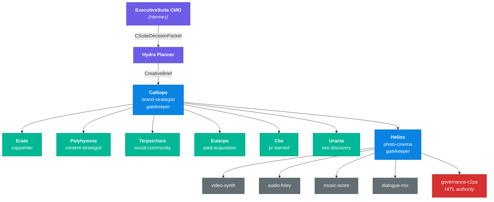
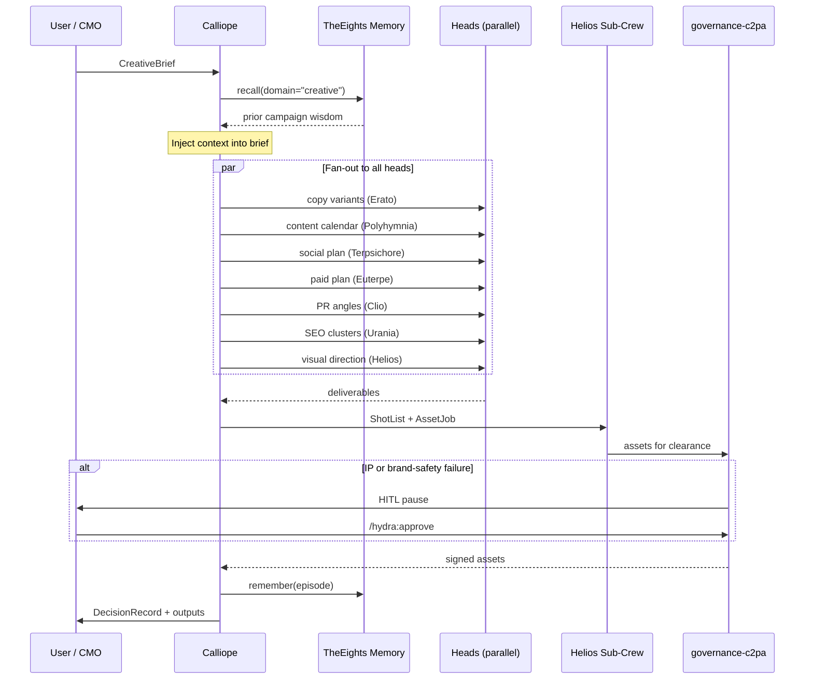
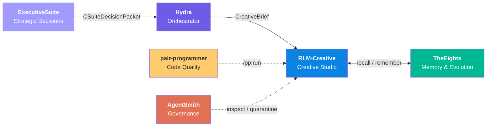

<p align="center">
  
  
  
  
  
</p>

# RLM-Creative — Eight Garland Heads

> A multi-agent creative production studio that turns strategic briefs into fully governed campaign deliverables — copy, content calendars, social plans, paid media specs, PR kits, SEO clusters, video, audio, and signed key art — using 13 specialized AI agents orchestrated through typed envelopes.

---

## What is RLM-Creative?

RLM-Creative is a **CrewAI-style multi-agent studio** built for end-to-end creative production. It takes a strategic brief (a product launch, a brand refresh, a visual direction request) and fans it out across eight specialized agents — named after the classical Muses plus Helios — who work in parallel to produce campaign-ready deliverables.

A five-agent sub-crew under Helios handles the production pipeline: video synthesis, foley/SFX, music scoring, dialogue mixing, and IP governance with [C2PA](https://c2pa.org/) provenance signing.

**Two ways to run it:**

- **Standalone in Claude Code** — Open this repo as your working directory. The three slash commands (`/creative-campaign`, `/photo-direction`, `/brand-refresh`) drive the full crew directly.
- **Orchestrated via [Hydra](https://github.com/lebobo88/Hydra)** — RLM-Creative registers as Hydra's `creative` squad. Strategic decisions from the [ExecutiveSuite](https://github.com/lebobo88/ExecutiveSuite) CMO flow through Hydra as `CreativeBrief` envelopes, and Hydra manages HITL gates, budget enforcement, and cross-squad routing.

---

## Architecture



<p align="center"><sub>
<span style="color:#6c5ce7">Purple</span> = external orchestration &nbsp;|&nbsp;
<span style="color:#0984e3">Blue</span> = gatekeepers &nbsp;|&nbsp;
<span style="color:#00b894">Green</span> = execution heads &nbsp;|&nbsp;
<span style="color:#636e72">Grey</span> = Helios sub-crew &nbsp;|&nbsp;
<span style="color:#d63031">Red</span> = HITL authority
</sub></p>

Each head follows the **CrewAI pattern**: role, goal, backstory, and tool list. Agents are event-driven peers that communicate via Hydra's typed envelopes (`CreativeBrief`, `ShotList`, `AssetJob`, `DecisionRecord`). Graph-level supervision belongs to Hydra's planner; RLM-Creative owns only the agent definitions and crew contract.

---

## The Eight Garland Heads

| Mythic Name | Slug | Authority | Scope |
|---|---|---|---|
| **Calliope** | `brand-strategist` | Gatekeeper (crew lead) | Brand strategy, brief intake, stakeholder comms, creative direction |
| **Erato** | `copywriter` | Execute | Long-form and short-form copy, voice adaptation per platform |
| **Polyhymnia** | `content-strategist` | Execute | Content calendar, pillar-to-repurpose planning, editorial architecture |
| **Terpsichore** | `social-community` | Execute | Platform-native social content, community engagement, tone calibration |
| **Euterpe** | `paid-acquisition` | Execute | Paid channel strategy, ROAS optimization, ad creative specification |
| **Clio** | `pr-earned` | Execute | Press angles, embargo management, press-kit assembly, earned media |
| **Urania** | `seo-discovery` | Execute | Semantic topic clusters, entity SEO, search-intent mapping |
| **Helios** | `photo-cinema` | Gatekeeper (sub-crew lead) | Visual direction, shot lists, key art, video synthesis, C2PA governance |

### Helios Sub-Crew (5 Production Specialists)

| Slug | Scope |
|---|---|
| `video-synth` | Kling / Veo / Seedance / Wan video model orchestration |
| `audio-foley` | Ambience, SFX, cue-sheet-driven audio production |
| `music-score` | Narrative-arc-driven music composition |
| `dialogue-mix` | Dialogue QC and multi-channel routing (5.1 / stereo) |
| `governance-c2pa` | IP risk scoring, C2PA signing, brand-safety enforcement (**HITL authority**) |

---

## How It Works

### Campaign Workflow



### HITL Gates

Human-in-the-loop approval is **required** before proceeding in these conditions:

| Trigger | Condition | Who fires it |
|---|---|---|
| **IP-clearance failure** | Asset cannot be cleared for commercial use | `governance-c2pa` |
| **Render cost > $200** | Any single `AssetJob` exceeds the budget threshold | `governance-c2pa` |
| **Brand-safety failure** | Hate speech, NSFW, competitor mention, off-brand claim detected | `governance-c2pa` |
| **Brand-refresh publish** | Final `/brand-refresh` output awaiting approval | Calliope |

Resume with `/hydra:approve` or reject with `/hydra:reject`.

---

## Getting Started

### Prerequisites

- [Claude Code](https://claude.ai/code) installed
- For Hydra orchestration: [Hydra](https://github.com/lebobo88/Hydra) running with the creative squad registered
- For memory: [TheEights](https://github.com/lebobo88/TheEights) bridge active

### Standalone (Claude Code)

Clone the repository and open it as your Claude Code working directory. `CLAUDE.md` automatically imports `AGENTS.md`, making all behavioral rules and head definitions available.

```bash
git clone https://github.com/lebobo88/RLM-Creative.git
cd RLM-Creative
```

Then use the slash commands directly:

```
# Full campaign from brief to deliverables
/creative-campaign Draft a launch campaign for Project Meridian targeting B2B SaaS buyers.

# Photo direction only
/photo-direction hero product shot — matte black hardware, studio lighting, minimalist

# Brand audit and refresh
/brand-refresh Acme Corp
```

### With Hydra Orchestration

Register RLM-Creative as the `creative` squad in your Hydra deployment. Set the `HYDRA_RLM_ROOT` environment variable to point at your RLM-Creative clone.

```bash
# Verify squad registration
python -m hydra_core.cli doctor
python -m hydra_core.cli squads

# Run a campaign via Hydra
python -m hydra_core.cli run "Draft a Q3 brand campaign for Acme" --squad creative
```

The squad manifest (`squad.yaml`) at the repo root is the canonical source. Hydra's copy at `squads/creative/squad.yaml` must be kept in sync or symlinked.

---

## Commands

### `/creative-campaign <brief>`

Full-crew run from brief through deliverables.

1. Calliope intakes the brief and emits a `CreativeBrief` envelope.
2. Calliope calls `eights.memory.recall(domain="creative")` to surface prior campaign wisdom.
3. **Parallel fan-out:** Erato (copy), Polyhymnia (content calendar), Terpsichore (social plan), Euterpe (paid plan), Clio (PR angles), Urania (SEO clusters), Helios (visual direction -> `ShotList` -> `AssetJob`).
4. `governance-c2pa` gates every asset. HITL interrupts on IP-clearance failure.
5. Synthesizer collates into `DecisionRecord` and writes to `RLM/output/launch/{topic}-{date}.md`.

### `/photo-direction <subject>`

Helios-led shot list and key art workflow. Skips Calliope when already inside an active campaign.

1. Helios intakes subject and generates a `ShotList` via the `shot-list-protocol` skill.
2. Sub-crew renders: `video-synth`, `comfyui`, `gemini-image`.
3. `governance-c2pa` signs approved assets with C2PA provenance.
4. Output written to `RLM/output/photo/{subject}-{date}.md`.

### `/brand-refresh <client>`

Calliope-led brand audit and reposition.

1. Calliope recalls existing brand artifacts from memory (`scopes: ["assetlib:approved"]`).
2. Audits voice (Erato), positioning (Calliope), visual identity (Helios in advisory mode).
3. Emits reposition recommendation and delta artifacts. **HITL gate before publish.**
4. Persists as `DecisionRecord`; `dissenting_opinions` field populated if Erato or Helios disagreed.

---

## Ecosystem Integration



### [Hydra](https://github.com/lebobo88/Hydra) — Orchestrator

Hydra is the multi-squad supervisor that routes goals to the right squad. RLM-Creative registers as the `creative` squad. Hydra converts `CSuiteDecisionPacket` envelopes (from ExecutiveSuite) into `CreativeBrief` envelopes, dispatches them to Calliope, manages HITL gates, and tracks workflow state. See [`integrations/hydra.md`](integrations/hydra.md) for the full wiring contract.

### [ExecutiveSuite](https://github.com/lebobo88/ExecutiveSuite) — Strategic Intake

The CMO agent (Hermes) in ExecutiveSuite emits marketing decisions as `CSuiteDecisionPacket` envelopes. When Hydra detects `domain: marketing` or non-empty `assets_required`, it converts the packet into a `CreativeBrief` and dispatches to the creative squad. **No changes to ExecutiveSuite are required** — RLM-Creative is a consumer-only participant. See [`integrations/executive-suite.md`](integrations/executive-suite.md) for the field mapping.

### [TheEights](https://github.com/lebobo88/TheEights) — Memory & Evolution

All memory operations use `domain="creative"` with controlled scope tags (`team:garland-crew`, `sensitive:ip`, `assetlib:approved`, etc.). Calliope recalls prior campaign wisdom before every run; post-run episodes are written back for cross-campaign learning. TheEights also governs skill evolution via risk-class policies. See [`integrations/eights.md`](integrations/eights.md) for the recall/remember contract.

### [pair-programmer](https://github.com/lebobo88/pair-programmer) — Code Quality

The `.harness/profile.yaml` defines the `creative-media` profile. `/pp:run` and `/pp:team` operate over this repo the same way they do over any other project in the ecosystem.

### [AgentSmith](https://github.com/lebobo88/AgentSmith) — Governance

AgentSmith can inspect agent definitions, quarantine rogue artifacts, and enforce constitutional invariants across the ecosystem. RLM-Creative's `AGENTS.md` is the authoritative behavioral contract that AgentSmith validates against.

---

## Repository Layout

```
RLM-Creative/
├── README.md                        # This file
├── AGENTS.md                        # Cross-tool behavioral contract (authoritative)
├── CLAUDE.md                        # @AGENTS.md import shim
├── heads.yaml                       # Canonical 8-head + 5-sub-agent registry
├── squad.yaml                       # Hydra squad manifest
├── hooks.json                       # Top-level hook registry
├── .harness/profile.yaml            # Pair-programmer profile: creative-media
├── .claude/
│   ├── agents/                      # 8 head agents + helios-crew/ (5 sub-agents)
│   ├── commands/                    # /creative-campaign, /photo-direction, /brand-refresh
│   ├── skills/                      # 10 reusable skill modules
│   └── hooks/                       # PowerShell enforcement hooks
├── RLM/
│   ├── prompts/                     # 8 phase prompt templates (01–08)
│   ├── specs/creative-constitution.md  # Brand non-negotiables & asset format specs
│   ├── tasks/                       # CAMPAIGN-NNN.md instances (populated at runtime)
│   ├── progress/                    # .current-context.md, events.jsonl (populated at runtime)
│   └── output/                      # {phase}/{topic}-{date}.md deliverables
│       ├── launch/                  # Full campaign deliverables
│       ├── photo/                   # Shot lists & key art
│       ├── brand/                   # Brand audit outputs
│       ├── brief/                   # Intermediate brief artifacts
│       ├── pr/                      # Press kits & embargo releases
│       ├── paid/                    # Paid channel plans & ad specs
│       ├── seo/                     # SEO cluster maps & keyword plans
│       └── governance/              # IP clearance decisions, C2PA records
└── integrations/
    ├── hydra.md                     # Hydra squad wiring contract
    ├── executive-suite.md           # CMO-to-CreativeBrief field mapping
    └── eights.md                    # TheEights memory domain & recall contract
```

---

## Skills

RLM-Creative ships with 10 reusable skill modules under `.claude/skills/`:

| Skill | Used by | Purpose |
|---|---|---|
| `creative-brief-protocol` | Calliope, governance-c2pa | CreativeBrief envelope intake, validation, and fan-out |
| `brand-safety` | Calliope, Helios, governance-c2pa | IP clearance, brand-guardrail enforcement |
| `platform-voice` | Erato, Terpsichore | Per-platform tone, length norms, hashtag etiquette |
| `editorial-calendar` | Polyhymnia, Terpsichore, Urania | Pillar-to-cluster-to-repurpose cadence planning |
| `channel-arbitrage` | Euterpe | ROAS targets, bid strategies, fatigue detection |
| `press-kit-protocol` | Clio | Story angles, embargo etiquette, press-kit assembly |
| `semantic-clustering` | Urania, Polyhymnia | Topic-cluster authority model, entity SEO, schema.org |
| `shot-list-protocol` | Helios, video-synth | ShotList schema, camera/lens grammar, pacing rules |
| `color-science` | Helios | LUTs, white-balance, mood-driven grading |
| `comfyui-workflow-recipes` | Helios, video-synth | Curated ComfyUI workflow recipes with cost estimates |

---

## Tool Boundaries

Strict access control enforced by the `pre-asset-write` hook:

- **Asset files** (`*.mp4`, `*.mov`, `*.wav`, `*.flac`, `*.png`, `*.jpg`) may only be written by Helios sub-crew agents.
- **ComfyUI** (`hydra-creative.comfyui.*`) may only be invoked by Helios (delegatable to `video-synth`).
- **Memory writes** (`eights.memory.remember`) restricted to Calliope, Helios, and `governance-c2pa`.
- **All `rlm.output.write` calls** must include `domain="creative"` and at least one controlled scope tag.

---

## Model Tiers

| Tier | Agents | Rationale |
|---|---|---|
| **Opus** | Calliope, Helios, governance-c2pa | Gatekeepers and IP-critical decisions require highest capability |
| **Sonnet** | Erato, Polyhymnia, Terpsichore, Euterpe, Clio, Urania | Execution heads — strong capability at efficient cost |
| **Haiku** | video-synth, audio-foley, music-score, dialogue-mix | Production sub-agents — tool-driven, lower reasoning overhead |

---

## Related Projects

| Project | Description |
|---|---|
| [Hydra](https://github.com/lebobo88/Hydra) | Multi-squad AI orchestrator — routes goals to specialized squads |
| [ExecutiveSuite](https://github.com/lebobo88/ExecutiveSuite) | C-suite executive agents (CEO, CFO, CMO, CTO, etc.) |
| [TheEights](https://github.com/lebobo88/TheEights) | Shared memory, evolution, and governance service |
| [AgentSmith](https://github.com/lebobo88/AgentSmith) | Cross-project agent governance, inspection, and quarantine |
| [pair-programmer](https://github.com/lebobo88/pair-programmer) | AI-assisted code quality harness with rubric-based judging |
